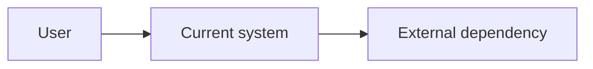
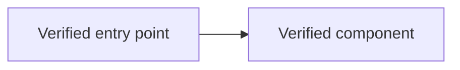
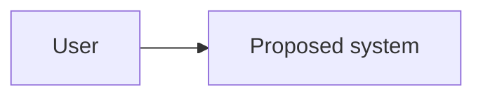
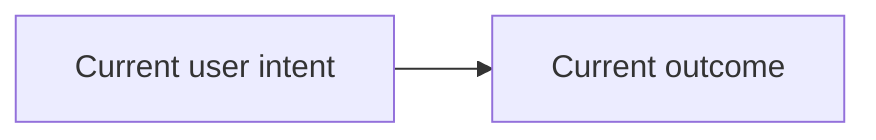
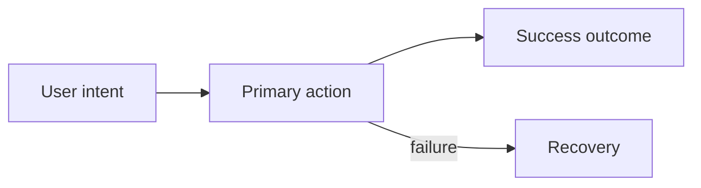

# `.ultra-goal/` templates

Read only the templates for the files you are creating right now. Use templates when creating a new goal or on an explicit user-requested reset — never to "repair" an existing working structure.

## Creation rules

Create at goal start (all tiers):

```text
.ultra-goal/
├── README.md        # one line: what this folder is
├── goal.md
├── plan.md
├── state.md
└── worklog.md
```

Create lazily, when the step that needs them starts:

- `project-audit.md` — when the audit begins (tier M/L)
- `decisions.md` — at the first recorded decision
- `architecture/current-state.md`, `architecture/proposed-state.md`, `architecture/traceability.md` — when creating views (tier L, or structure changes)
- `debate/<provider>.md`, `debate/synthesis.md` — when the first analysis / synthesis is written; never pre-create empty placeholders
- `ui/brief.md`, `ui/user-flow.md`, `ui/wireframes.md`, `ui/mockup.html`, `ui/decisions.md` — only when UI is in scope
- `worklog-archive.md` — when `worklog.md` exceeds ~300 lines

Use `unknown` rather than inventing missing information.

## `.ultra-goal/README.md`

```markdown
Durable multi-session goal state (ultra-goal protocol). Handoff file set for
Claude / Codex / Grok / other agents. Do not edit manually unless you know the
protocol; see the ultra-goal skill.
```

## `goal.md`

```markdown
# Goal

## Objective
<final result>

## Expected outcome
<observable user-facing outcome>

## Non-goals
- <explicit exclusion or unknown>

## Constraints
- <technical, business, time, safety, or compatibility constraint>

## Acceptance criteria
- [ ] <observable criterion and verification method>

## Open questions
- <material unknown or none>
```

## `plan.md`

```markdown
# Plan

## Discovery
- [ ] **NEXT** Discover instructions, documentation, and actual architecture
- [ ] Compare documented claims with code evidence
- [ ] Create verified current-state architecture views (tier L)
- [ ] Define current user flow when UI is in scope

## Debate
- [ ] Write provider analysis
- [ ] Compare alternatives and risks
- [ ] Produce synthesis

## Approval
- [ ] Ask the authorization question; receive a clear affirmative

## Implementation
- [ ] <planned step, initially provisional>
- [ ] Update README, ROADMAP, or docs where impact requires it (after "update docs" or in scope)

## Verification
- [ ] Run acceptance checks
- [ ] Reconcile architecture and UI artifacts with implementation
- [ ] Repeat code-to-documentation drift check
- [ ] Record evidence

## Completion
- [ ] User confirms tested and achieved
- [ ] Next goal? → reset, or ROADMAP entry + delete `.ultra-goal/`
```

Maintain exactly one `**NEXT**` marker across the file.

## `state.md`

```markdown
---
updated_at: <ISO 8601 timestamp with timezone>
phase: discovery
tier: L
authorized_scope: none
active_provider: <claude|codex|grok|other>
---

# State

## Authorization evidence
none
<!-- when authorized, replace with:
- Question (verbatim): "<the authorization question asked in chat>"
- Answer (verbatim): "<the user's affirmative message>"
- Timestamp: <ISO 8601 with timezone>
-->

## Position
<what is known and where work stopped — free prose>

## Last completed action
<action and result, or none>

## Next action
<one safe action>

## Blockers
- <blocker or none>

## Files changed outside `.ultra-goal/`
- none
```

Allowed phases: `discovery`, `debate`, `ready-for-approval`, `implementation`, `blocked`, `complete`.

`authorized_scope` is either `none` or a short text describing exactly what implementation is approved (for example `Phase 0 — parity fix + input validation`).

## `project-audit.md`

````markdown
# Project reality audit

updated_at: <ISO 8601 timestamp with timezone>
status: in-progress

## Sources inspected
- <path>: <why it matters>

## Root structure
```text
<one-level tree with concise purpose comments>
```

## Actual architecture
- Entry points: <evidence>
- Main modules and ownership: <evidence>
- Important dependencies and contracts: <evidence>
- Build, test, deployment, and operations: <evidence>
- Existing user interface and design system: <evidence or not applicable>

## Documentation comparison
| Documented claim | Code evidence | Status | Required action |
|---|---|---|---|
| <claim> | <path, symbol, config, or test> | confirmed, stale, contradicted, or unknown | <action or none> |

## Documentation plan
- README: <keep, create, or update and why>
- ROADMAP: <keep, create, update, or not applicable and why>
- docs/: <important document changes only>

## Unknowns
- <unknown or none>
````

Use audit status `in-progress`, `complete-with-drift`, or `complete-aligned`.

## `architecture/current-state.md`

````markdown
# Current-state architecture

updated_at: <ISO 8601 timestamp with timezone>
status: CURRENT — VERIFIED

## Scope
<question answered by these views>

## System context


## Runtime, workflow, or operations view


## Unknowns
- <unknown or none>
````

Include only useful views. Replace placeholder nodes with evidence-backed elements.

## `architecture/proposed-state.md`

````markdown
# Proposed-state architecture

updated_at: <ISO 8601 timestamp with timezone>
status: PROPOSED — NOT IMPLEMENTED

## Goal addressed
<goal and constraints>

## Proposed architecture


## Changes from current state
- Add: <component or none>
- Change: <component or none>
- Remove: <component or none>

## User, development, and operational effects
- User: <effect>
- Development: <effect>
- Operations: <effect>

## Assumptions
- <assumption or none>
````

## `architecture/traceability.md`

```markdown
# Architecture traceability

| Element or flow | Status | Evidence or decision | Owner | Verification needed |
|---|---|---|---|---|
| <element> | CURRENT — VERIFIED, PROPOSED — NOT IMPLEMENTED, IMPLEMENTED — VERIFIED, or UNKNOWN | <path, symbol, config, test, or decision ID> | <owner or unknown> | <check or none> |
```

## Conditional UI artifacts

Create these only when UI is in scope.

### `ui/brief.md`

```markdown
# UI brief

updated_at: <ISO 8601 timestamp with timezone>
status: discovery

## Users and primary job
- User: <user>
- Primary job: <job>
- Success: <observable outcome>

## Product and platform context
- Platform and devices: <context>
- Existing design system: <evidence or none>
- Accessibility and performance constraints: <constraints>

## Current guidance research
| Source | Accessed | Applicable guidance | Limitation |
|---|---|---|---|
| <official URL or local standard> | <date> | <guidance> | <limitation> |

## Required states
- Initial and empty: <behavior>
- Loading and progress: <behavior>
- Success: <behavior>
- Error and recovery: <behavior>
- Permission or authentication: <behavior>
- Responsive and keyboard: <behavior>

## Unknowns
- <unknown or none>
```

### `ui/user-flow.md`

````markdown
# User flow

## Current flow

status: CURRENT — VERIFIED or not applicable



## Proposed flow

status: PROPOSED — NOT IMPLEMENTED



## Flow notes
- Current evidence: <path, rendered UI, or not applicable>
- Decision, assumption, or alternative: <note>
````

### `ui/wireframes.md`

````markdown
# UI wireframes

status: PROPOSED — NOT IMPLEMENTED

## Primary screen
```text
<low-fidelity wireframe>
```

## Meaningful alternative
```text
<alternative or not applicable>
```

## State coverage
- <state>: <wireframe behavior>
````

### `ui/mockup.html`

Create a valid, responsive, self-contained static HTML mockup after choosing the wireframe. Use semantic markup and accessible controls. Do not connect to production services, include secrets, or imply working backend behavior.

### `ui/decisions.md`

```markdown
# UI decisions

| ID | Decision | Alternatives | User benefit | Engineering cost | Evidence |
|---|---|---|---|---|---|
| UI-001 | <decision> | <alternatives> | <benefit> | <cost> | <research, test, or user input> |
```

## `decisions.md`

```markdown
# Decisions

| ID | Status | Decision | Alternatives | Rationale | Evidence |
|---|---|---|---|---|---|
| D-001 | pending | <decision> | <alternatives> | <reason> | <file, command, result, or unknown> |

## Decision notes

### D-001

- Owner: <user|provider|shared>
- Risks: <risks>
- Revisit when: <condition>
```

Use statuses `pending`, `accepted`, `rejected`, or `superseded`.

## `worklog.md`

```markdown
# Worklog

Append only. Do not remove or rewrite prior entries.

## <ISO 8601 timestamp> — <provider> — <action>

- Phase: <phase>
- Tried: <what was done>
- Result: <what happened>
- Evidence: <command, output, file path, test name, URL, or verbatim user message — REQUIRED>
- Next: <next safe action>
```

An entry without evidence is invalid. When the file exceeds ~300 lines, move older entries to `worklog-archive.md` and keep a 10-line summary at the top of `worklog.md`.

## Provider debate files

Use the same template for `debate/claude.md`, `debate/codex.md`, `debate/grok.md`, and `debate/other.md`. Create a file only when that provider actually contributes.

```markdown
# <Provider> analysis

updated_at: <ISO 8601 timestamp with timezone>
status: contributed

## Facts
- <verified fact>

## Assumptions
- <assumption requiring confirmation>

## Proposed approach
<proposal>

## Alternatives considered
- <alternative>: <trade-off>

## Risks and mitigations
- <risk>: <mitigation>

## Challenges to existing proposals
- <challenge or none>

## Open questions
- <question or none>

## Recommendation
<current recommendation>
```

Use status `contributed` or `revised`. Cover only material debate points; mark the rest `not applicable`.

## `debate/synthesis.md`

```markdown
# Debate synthesis

updated_at: <ISO 8601 timestamp with timezone>
status: collecting

## Contributors
- <provider>: <file> (<contributed|revised>)

## Shared conclusions
- <conclusion or none>

## Unresolved disagreements
- <disagreement or none>

## Alternatives and trade-offs
| Alternative | Benefits | Costs and risks | Verdict |
|---|---|---|---|
| <option> | <benefits> | <costs> | <selected, rejected, or pending> |

## Recommended approach
<chosen design>

## Why this approach
<reasoning tied to goal and evidence>

## Reality baseline
<what the project demonstrably does now and where documentation differs>

## Risks and mitigations
- <risk>: <mitigation>

## Implementation sequence
1. <step>

## Acceptance checks
- [ ] <check>

## Documentation deliverables
- README: <required change or none>
- ROADMAP: <required change or not applicable>
- docs/: <required important changes or none>

## Remaining questions
- <question or none>

## Approval gate
Implementation remains forbidden until the user gives a clear affirmative to
the explicit authorization question (see the skill's authorization gate).
```

Use synthesis status `collecting`, `needs-user-input`, or `ready-for-approval`. List only providers whose files exist; never list absent providers as "pending".

## ROADMAP completion entry

On goal completion with no next goal, append to the project ROADMAP before deleting `.ultra-goal/`:

```markdown
## <YYYY-MM-DD> — <goal title> — DONE
<one or two sentences: what shipped and how it was verified>
```
